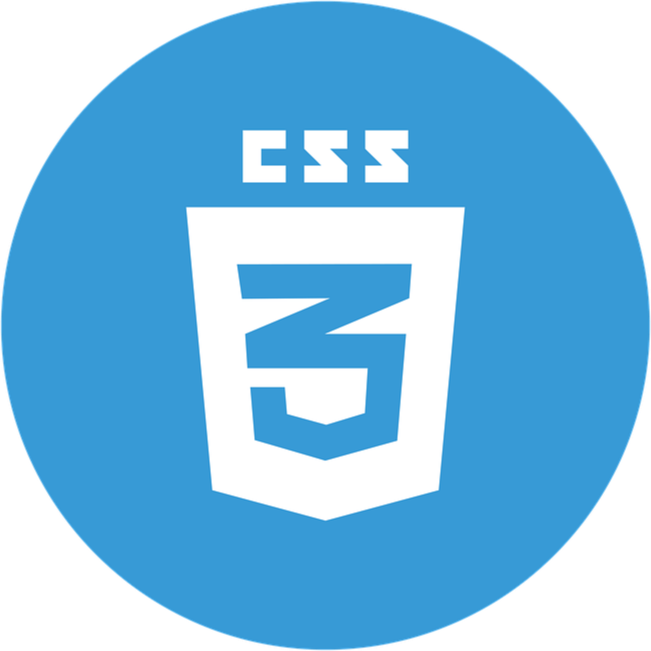

### Hi, I'm Raul 👋

A Full-Stack Programmer that loves apply his knowledge to solve problems, create amazing products and impact lives.

## Languages and Tools I currently use

## Languages and Tools I've ever used

# My Projects Django

  <kbd>
    
  </kbd>

- 🔭 I’m currently working on System Assistant
- 🌱 I’m currently learning Python and Java
- 📫 How to reach me: [WhatsApp](https://api.whatsapp.com/send?phone=5549991781296&text=Enviar%20mensagem%20para%20Raul)
- ⚡ Fun fact: Musician (Transverse Flute, Sax, Guitar and Piano)